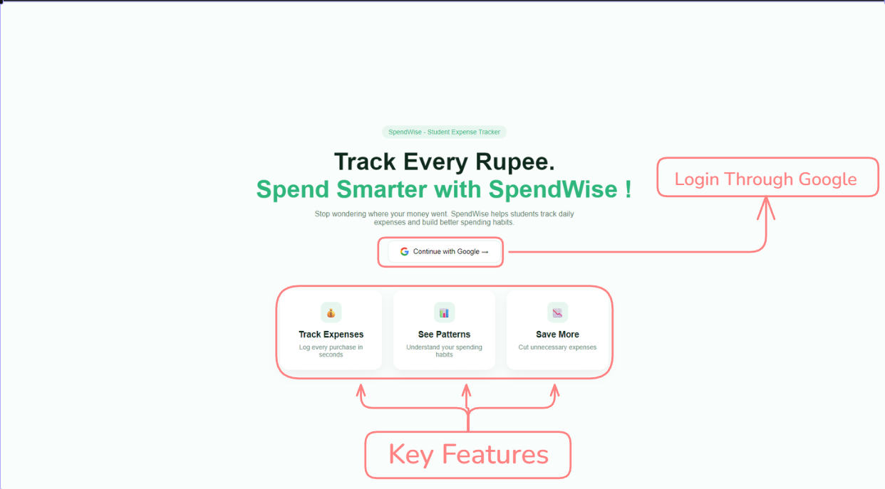
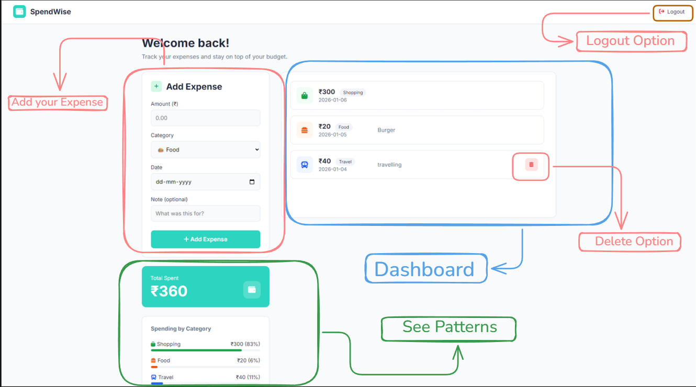

  SpendWise — Student Expense Tracker

-> Track every rupee. Spend smarter with SpendWise

-> SpendWise is a simple and student-focused web app that helps users understand where their money goes and build better spending habits — without complexity.
_______________________________________________________________________________________________________________________________________________________________________________________________________________________________________________________________________________

##  Live Demo -> **https://spendwise-a9795.web.app/**

   (Deployed using Firebase Hosting)
_______________________________________________________________________________________________________________________________________________________________________________________________________________________________________________________________________________

##  How It Works

1. User opens SpendWise
2. Signs in using **Google Authentication**
3. Redirected to personal dashboard
4. Adds daily expenses
5. Data is stored  in Firebase
6. User can view and manage expenses anytime

##  User Flow

Landing Page
   ↓
Google Sign-In (Firebase Auth)
   ↓
Dashboard
   ↓
Add / View /Delete Expenses
   ↓
Data Saved in Firestore

_______________________________________________________________________________________________________________________________________________________________________________________________________________________________________________________________________________

## Google Technologies Used 

* Firebase Authentication – Enables secure and seamless Google Sign-In for users.

* Firebase Firestore – Used as a real-time cloud database to store user-specific expense data .

* Firebase Hosting – Deploys and serves the web application with fast, reliable, and secure access.

_______________________________________________________________________________________________________________________________________________________________________________________________________________________________________________________________________________

